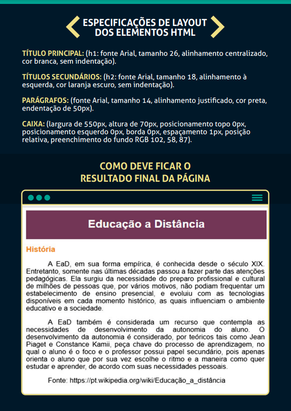

# UniversityTaskReponsiveWeb

RESPONSIVE WEB DEVELOPMENT


#### Task 01 
```
Um escola contratou você para ajudá-los a colocar em seu site todo o conteúdo que é trabalhado com os alunos ao longo do ano. Uma das professoras das séries iniciais está trabalhando as cores com a sua turma e gostaria de organizá-las no site de forma a ficar claro que as cores classificam-se em três tipos e que, cada um desses tipos, possui cores específicas.
Levando em consideração que em documentos hipertexto, as listas servem para relacionar itens, normalmente dispostos com marcadores, para facilitar a visualização dos elementos que pertencem a determinados grupos, ajude a professora criando um documento HTML que apresente uma lista não ordenada que relacione a classificação das cores (primárias, secundárias e terciárias). Cada uma dessas listas deve conter uma lista ordenada aninhada, que apresente as respectivas cores de cada uma, conforme imagem a seguir:
```

#### Task 02
```
Formulários HTML são utilizados por sistemas web para agrupar elementos de uma página com o objetivo de captar ou apresentar dados. Os elementos de uma página web são os campos de formulário, que permitem apresentar, editar e validar informações por meio de diversos formatos, como texto, listas e botões.

Você, web designer, foi contratado por uma faculdade para desenvolver o formulário de uma página web que permite o lançamento das notas de alunos. Você precisa implementar o código HTML desse formulário, conforme o protótipo que pode ser visto na imagem a seguir:
Para isso, você deve usar as seguintes regras:

1. A seleção da disciplina deve ser realizada por uma lista definida, com as seguintes opções: Introdução à informática, Linguagens de Programação, e Programação de Computadores;

2. As notas (prova 1, prova 2 e exame) devem aceitar apenas a digitação de números, na faixa entre 0 e 10;

3. A média será calculada e não deve permitir a inserção de valores*;

4. As faltas também devem aceitar apenas a digitação de números e a faixa de valores aceitáveis é de 0 a 16;

5. Os campos prova 1, prova 2 e faltas são de preenchimento obrigatório.

*Utilize o atributo readonly= “” para impedir a entrada de dados nos campos desejados.
```

#### Task 03
```
A formatação de páginas web se dá pela decoração de elementos HTML. Essa decoração ocorre pela aplicação de folhas de estilo em cascata (CSS) nas páginas, permitindo padronizar layouts, além de organizar o conteúdo, separando a estrutura de um documento HTML da formatação de sua apresentação.

Você, web designer de uma instituição de ensino, está criando um arquivo CSS e formatando a página HTML da instituição, cujas especificações e elementos podem ser observados no arquivo a seguir:

```

#### Task 04
```
1 - Pesquisar a diferença entre o JavaScript e a linguagem JAVA.
2 - Quais empresas criaram o JavaScript e o JAVA, e quais são as que atualmente mantêm o desenvolvimento dessas linguagens?
3 - Criar um código HTML que tenha um botão que faça com que a página fique da cor AZUL, por meio de uma chamada de JavaScript (anexar o arquivo com o código).
```